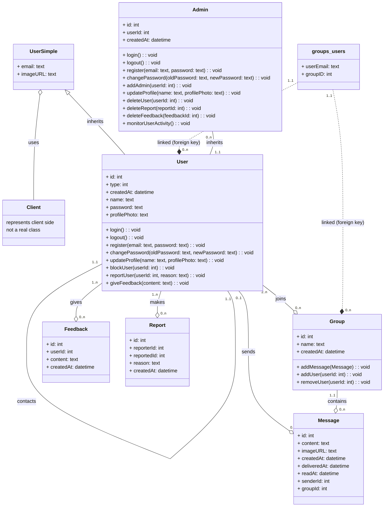

# Convo Connect

Chat application

  

---

### Class diagram

```mermaid
classDiagram
class Client {
  represents client side
  not a real class
}
class UserSimple {
  + email: text
  + imageURL: text
}
class User {
  + id: int
  + type: int
  + createdAt: datetime
  + name: text
  + password: text
  + profilePhoto: text
  + login(): void
  + logout(): void
  + register(email: text, password: text): void
  + changePassword(oldPassword: text, newPassword: text): void
  + updateProfile(name: text, profilePhoto: text): void
  + blockUser(userId: int): void
  + reportUser(userId: int, reason: text): void
  + giveFeedback(content: text): void
}
class Admin {
  + id: int
  + userId: int
  + createdAt: datetime
  + login(): void
  + logout(): void
  + register(email: text, password: text): void
  + changePassword(oldPassword: text, newPassword: text): void
  + addAdmin(userId: int): void
  + updateProfile(name: text, profilePhoto: text): void
  + deleteUser(userId: int): void
  + deleteReport(reportId: int): void
  + deleteFeedback(feedbackId: int): void
  + monitorUserActivity(): void
}
class Message {
  + id: int
  + content: text
  + imageURL: text
  + createdAt: datetime
  + deliveredAt: datetime
  + readAt: datetime
  + senderId: int
  + groupId: int
}
class Group {
  + id: int
  + name: text
  + createdAt: datetime
  + addMessage(Message): void
  + addUser(userId: int): void
  + removeUser(userId: int): void
}
class groups_users {
  + userEmail: text
  + groupID: int
}
class Feedback {
  + id: int
  + userId: int
  + content: text
  + createdAt: datetime
}
class Report {
  + id: int
  + reporterId: int
  + reportedId: int
  + reason: text
  + createdAt: datetime
}

UserSimple o-- Client : uses
UserSimple <|-- User : inherits
User "1..1" -- "1..1" User : contacts
User "0..1" --o "0..n" Message : sends
User "2..n" --o "0..n" Group : joins
Group "1..1" --o "0..n" Message : contains
groups_users "1..1" ..* "0..n" User : linked (foreign key)
groups_users "1..1" ..* "0..n" Group : linked (foreign key)
User "1..n" --o "0..n" Feedback : gives
User "1..n" --o "0..n" Report : makes
Admin "0..n" -- "1..1" User : inherits
```
